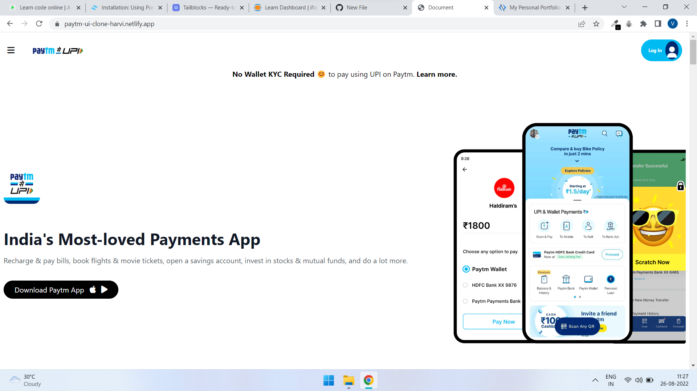
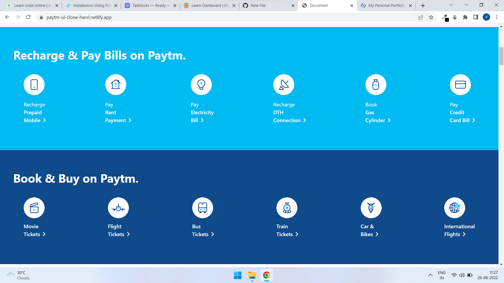
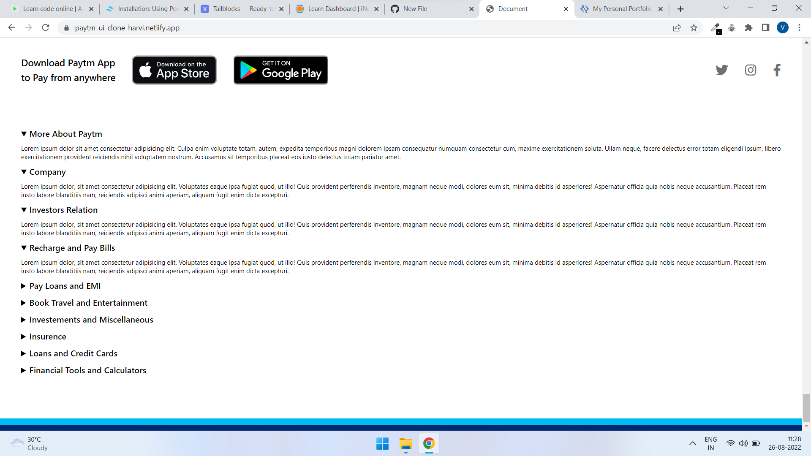

# Paytm UI Clone by **Vinay Pratap Singh**
## Overview
This is a Paytm user interface clone created using the pure HTML and Tailwind CSS. This webpage contains all the informations which are avilable over the original paytm website.
The origianl paytm has a very poor user interface for mobile phones as well also for the web, as we can see that the websites information breaks at most places due to abnormal user interface,
this is a try to fix that interface issue for both the popular devices mobile phone and pc.

> I had modified some designs of the website to look it proper for user in both the devices.

## Technology Used
1. Pure HTML
2. Tailwind CSS

## Live Link
Please visit the website by given link and ping your opinion over it, it will motivate me a lot and will also help me to improve my skills and mistakes in future.

## Output
    
    
    